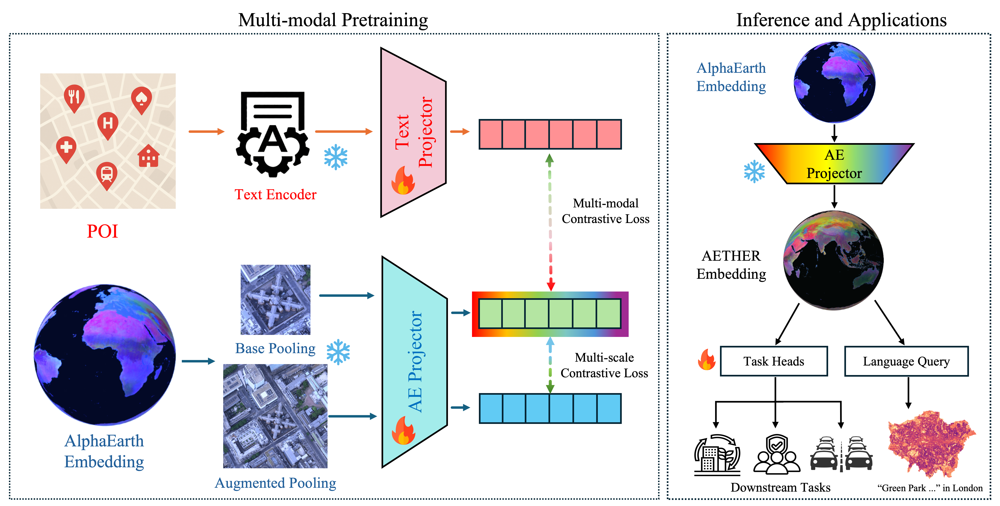

# AETHER: AlphaEarth–POI Enriched Representation Learning


AETHER is a lightweight multimodal alignment framework that aligns **AlphaEarth (AE) embeddings** with **POI-derived urban semantics** through contrastive learning.
The aligned representations support both **urban downstream tasks** and **natural language–conditioned spatial retrieval**.

<p align="center">
  
</p>

Paper:
- https://arxiv.org/abs/2510.09894
- https://www.researchgate.net/publication/396458142

*Note: The current preprint provides an early version of the work.  
The complete paper will be released in a forthcoming version.*

AlphaEarth embeddings are introduced by DeepMind in  
https://deepmind.google/blog/alphaearth-foundations-helps-map-our-planet-in-unprecedented-detail/


## Installation

Clone the repository:

    git clone <repo-url>
    cd AETHER

Create a Python environment:

    python3 -m venv .venv
    source .venv/bin/activate

Install dependencies:

    pip install -r requirements.txt

---

## Data Preparation

## AlphaEarth Embeddings

Download AlphaEarth embeddings and place them in:

    data/AE/AlphaEarth_embedding.tif

The raster should contain **64-dimensional AlphaEarth embeddings**.

---

## POI Dataset

Prepare a POI dataset containing:

| Field | Description |
|------|-------------|
| id | POI id |
| description | textual description used for embedding|
| geometry | point geometry |

Example file:

    data/poi/poi_example.geojson
---

## Text Embeddings

Two text encoding options are supported.

### OpenAI

Set API key:

    export OPENAI_API_KEY=your_key_here

Model example:

    text-embedding-3-large
    text-embedding-3-small

### HuggingFace

Example model:

    sentence-transformers/all-MiniLM-L6-v2


## Training AETHER

Training is controlled by a configuration file.

Run:

    python train.py --cfg config.yaml

The training pipeline performs the following steps:

1. Load POI data with textual descriptions and spatial coordinates  
2. Extract AlphaEarth embeddings around POI locations using **spatial window pooling**  
3. Encode POI text using a pretrained language model  
4. Project AE and POI embeddings into a shared latent space  
5. Train a multimodal contrastive alignment model

For each POI location, two spatial views are constructed:

- **Base view:** AE embeddings pooled from a smaller spatial window  
- **Augmented view:** AE embeddings pooled from a larger spatial window

These two views capture spatial context at different scales.

The model jointly optimizes two contrastive objectives:

    L = λ L_AE-AE + (1-λ) L_AE-POI

where:

- **L_AE-AE** enforces multi-scale consistency between AE embeddings
- **L_AE-POI** aligns AE embeddings with POI semantic representations

## Inference AETHER embeddings

To transform AlphaEarth embeddings into AETHER embeddings:

```bash
python infer_aether_raster.py \
  --ae_tif data/AE/UK_alphaearth_embedding_2024.tif \
  --ckpt /home/jliu/code/AE/outputs/tri2_AEProj-TextProj_UK_t3s_pix0-aug1_tau0.07-0.07_lam0.20_h256_l1_d128_bs4096_lr1e-03_epo100/ckpts/epoch_0100.pth \
  --out data/AE/AETHER_embedding.tif


## Citation

If you use AETHER in your research, please cite:

    @article{liu2025beyond,
    title   = {Beyond AlphaEarth: Toward Human-Centered Geospatial Foundation Models via POI-Guided Contrastive Learning},
    author  = {Liu, Junyuan and Qin, Quan and Dong, Guangsheng and Wang, Xinglei and Feng, Jiazhuang and Zeng, Zichao and Cheng, Tao},
    journal = {arXiv preprint arXiv:2510.09894},
    year    = {2025},
    url     = {https://arxiv.org/abs/2510.09894}
    }